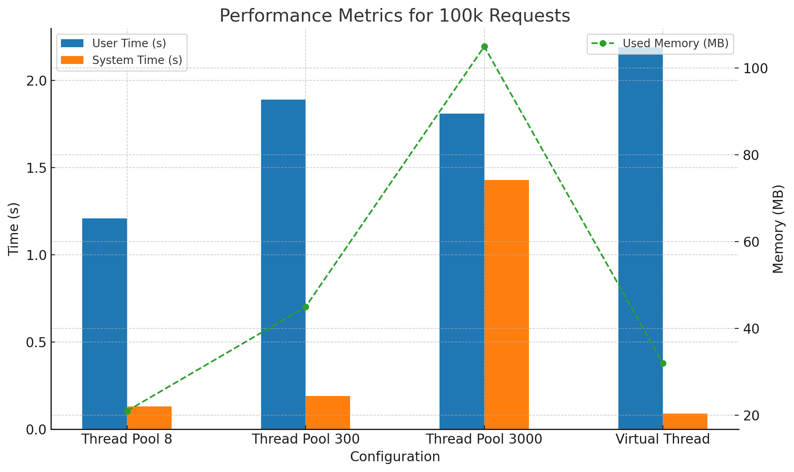
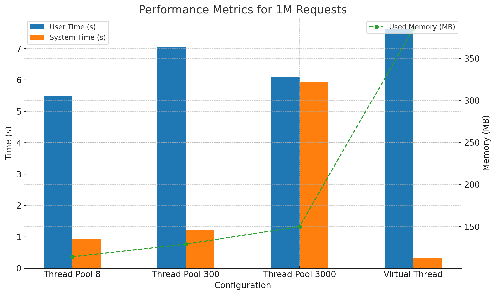
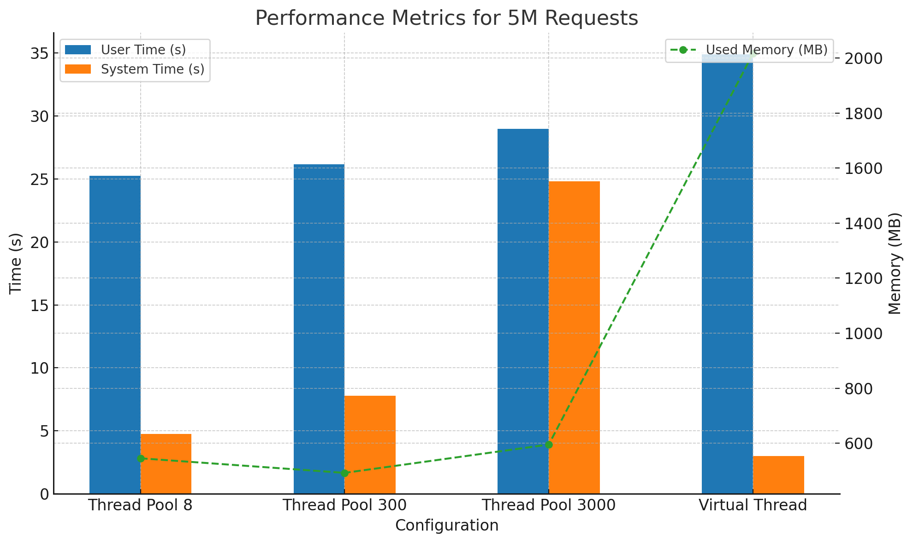
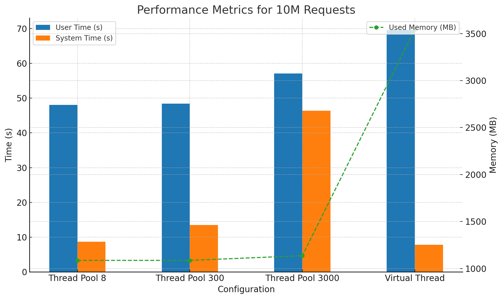
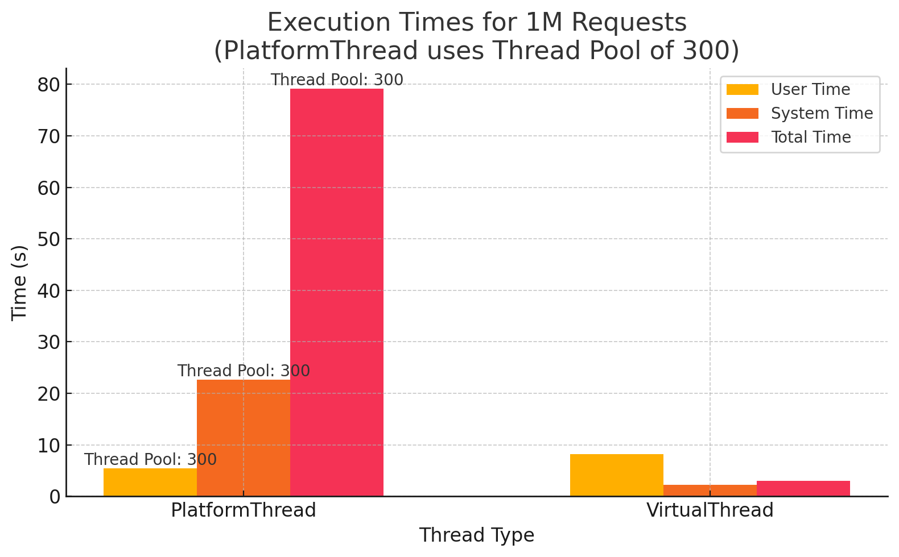

# Environment

```
% java --version
openjdk 21 2023-09-19
OpenJDK Runtime Environment (build 21+35-2513)
OpenJDK 64-Bit Server VM (build 21+35-2513, mixed mode, sharing)
```

# Comparison: Virtual Thread v.s. Platform Thread

Test codes: 

- `src/main/java/net/n/example/high_concurrent_java_server/draft/virtual/benchmark/thread/PlatformThread.java`
- `src/main/java/net/n/example/high_concurrent_java_server/draft/virtual/benchmark/thread/VirtualThread.java`

## Conclusion 1: CPU-Bound Tasks

draft/virtual/benchmark/thread/note









From the experimental results:

- Platform Threads: Thread pools using platform threads exhibit lower execution times and reduced memory consumption for CPU-bound tasks.
- Virtual Threads: Virtual threads result in slightly higher user time and significantly higher memory usage when handling CPU-bound tasks.

## Conclusion 2: IO-Bound Tasks




For IO-bound tasks:

- Platform Threads: Thread pools using platform threads suffer blocking due to IO operations, leading to increased total execution time.
- Virtual Threads: Virtual threads handle IO tasks efficiently by avoiding OS thread preemption during IO operations, significantly reducing total execution time.

# Caution

There are some edge cases that the virtual threads preempt the OS thread.

[JEP 425: Virtual Threads (Preview)](https://openjdk.org/jeps/425)
> There are two scenarios in which a virtual thread cannot be unmounted during blocking operations because it is *pinned* to its carrier:
> 
> 1. When it executes code inside a `synchronized` block or method, or
> 2. When it executes a `native` method or a [foreign function](https://openjdk.java.net/jeps/424).

# Application in Microservices

## Key Considerations:

In microservices, where network IO dominates a single request’s lifecycle, virtual threads provide significant advantages. Traditional socket operations, when executed using virtual threads, allow the underlying OS thread to remain unblocked during IO.

We do lots of network IO in one request. Can we migrate to use virtual thread on traditional `Socket`?

## Socket Behavior with Virtual Threads

### Source Code Insights

- Socket operations such as `connect`, `read`, and `write` are managed by `NioSocketImpl`.
- For virtual threads, these operations unmount the virtual thread, enabling the OS thread to switch to other runnable tasks.

```java
new Socket(...);

private static SocketImpl createImpl() {
    ...skip...
    // create a SOCKS SocketImpl that delegates to a platform SocketImpl
    SocketImpl delegate = SocketImpl.createPlatformSocketImpl(false);
    ...skip...
}

static <S extends SocketImpl & PlatformSocketImpl> S createPlatformSocketImpl(boolean server) {
    return (S) new NioSocketImpl(server);
}
```

It returns `NioSocketImpl`. And how `NioSocketImpl` does IO operations such as `connect`, `read` and `write`?

```java
protected void connect(SocketAddress remote, int millis) throws IOException {
    ...skip...
    while (!polled && isOpen()) {
        park(fd, Net.POLLOUT);
        polled = Net.pollConnectNow(fd);
    }
    ...skip...
}

private int implRead(byte[] b, int off, int len) throws IOException {
    ...skip...
    while (IOStatus.okayToRetry(n) && isOpen()) {
        park(fd, Net.POLLIN);
        n = tryRead(fd, b, off, len);
    }
    ...skip...
}

private int implWrite(byte[] b, int off, int len) throws IOException {
    ...skip...
    while (IOStatus.okayToRetry(n) && isOpen()) {
        park(fd, Net.POLLOUT);
        n = tryWrite(fd, b, off, len);
    }
    ...skip...
}

private void park(FileDescriptor fd, int event, long nanos) throws IOException {
    Thread t = Thread.currentThread();
    if (t.isVirtual()) {
        Poller.poll(fdVal(fd), event, nanos, this::isOpen); // Parks the current thread until a file descriptor is ready for the given op.
        if (t.isInterrupted()) {
            throw new InterruptedIOException();
        }
    }
    ...skip...
}
```

### How `NioSocketImpl` Works

- Connect, Read, and Write: When these methods are invoked on a virtual thread, the virtual thread is parked, allowing the OS thread to execute other tasks.

- Polling Behavior: A breakpoint in `Poller.poll` shows the following sequence:

    1. While `implRead` blocks on `Poller.poll` for network IO, the virtual thread unmounts.
    2. The OS thread immediately schedules CPU tasks, ensuring efficient resource utilization.

## Experiment Replication

Setup Instructions:

- Limit the system to one CPU core.
- Create two virtual threads:
  - One for a network IO task.
  - Another for a CPU-intensive task.
- Add a breakpoint in Poller.poll to observe the behavior.

Expected Behavior:

- When implRead blocks on Poller.poll, the next step seamlessly switches to the CPU-intensive task.

Code Location:

- Client and server implementation for this experiment can be found in:
  - Run echo server `mvn exec:java -Dexec.mainClass=net.n.example.high_concurrent_java_server.draft.server.EchoVirtualServer -q`
  - Run client `mvn exec:java -Dexec.mainClass=net.n.example.high_concurrent_java_server.draft.virtual.NonBlockedNetTask -q`

# Asynchronous I/O and Connection Management

## Overcoming I/O Blocking

To address the blocking issue inherent in synchronous I/O operations, we utilize the asynchronous I/O capabilities of the operating system, such as epoll in Linux. Java's NIO package builds upon these asynchronous I/O facilities, providing non-blocking channels. Netty, an advanced network application framework, further abstracts these capabilities into an event-driven architecture where an event loop continuously listens for completed I/O operations. This model significantly reduces the time threads spend waiting on I/O operations, thereby improving application scalability and responsiveness.

## Efficient Connection Management

Creating a new network connection for each request can quickly exhaust system resources, such as ports and RAM. To mitigate this, connection reuse strategies are implemented. While HTTP/1.1 supports persistent connections to reuse connections across multiple requests, it lacks support for concurrent requests over the same connection. HTTP/2 addresses this limitation by introducing the concept of "streams," allowing multiple requests (streams) to be multiplexed over a single connection. Each stream is divided into many smaller frames, which can be interleaved and sent concurrently. This advancement significantly increases the efficiency of network resource utilization.

Furthermore, gRPC, built on top of HTTP/2, provides a robust framework for developing performant, scalable microservices by enabling full-duplex streaming and effective connection management. gRPC’s streaming capabilities ensure that connections are utilized efficiently, supporting high concurrency and lower latency.

# Resilience Patterns in Microservices

## Circuit Breaker

The Circuit Breaker pattern is a resilience mechanism that guards an application against cascading failures in a distributed environment. By monitoring the number of failed requests within a given time frame, the circuit breaker can detect when a backend service is potentially overwhelmed. Once a predefined threshold is reached, the circuit breaker trips, and all further attempts to invoke the failed service are automatically redirected or rejected, typically until the service is deemed healthy again. This pattern helps to maintain service stability and prevent failures from escalating across services.

## Rate Limiter

Contrary to the reactive approach of the Circuit Breaker, the Rate Limiter proactively manages traffic to a service by limiting the number of requests that can be made within a certain time period (e.g., queries per second). This is crucial for protecting services from being overwhelmed by sudden spikes in demand and for maintaining a consistent performance level under varying load conditions. Rate limiting can be critical in systems where resource consumption costs are a concern, as it helps in controlling the operational load and ensuring fair use of resources among consumers.

# Implementation Examples with Netty

## HTTP/1.1 Implementation Using Netty

In the provided example under src/main/java/{package}/draft/netty/http1, we demonstrate how to implement an HTTP/1.1 server using Netty, which utilizes persistent connections to reduce the overhead of connection establishment and teardown, thereby enhancing the performance for frequent HTTP requests.

## HTTP/2 Implementation Using Netty

The example located at src/main/java/{package}/draft/netty/http2 shows how to set up an HTTP/2 server with Netty. This example takes advantage of HTTP/2's capability to handle multiple concurrent requests on a single connection through streams, significantly optimizing the use of network connections and improving throughput.

## gRPC Example

Under src/main/java/{package}/draft/gRPC, you can find an implementation of a gRPC service. This setup benefits from HTTP/2's features and provides a structured way to define service contracts, making it easier to build high-performance, scalable microservices architectures.

These examples and explanations should provide a comprehensive overview of the techniques and patterns used in your project, helping others understand and potentially contribute to its development.
